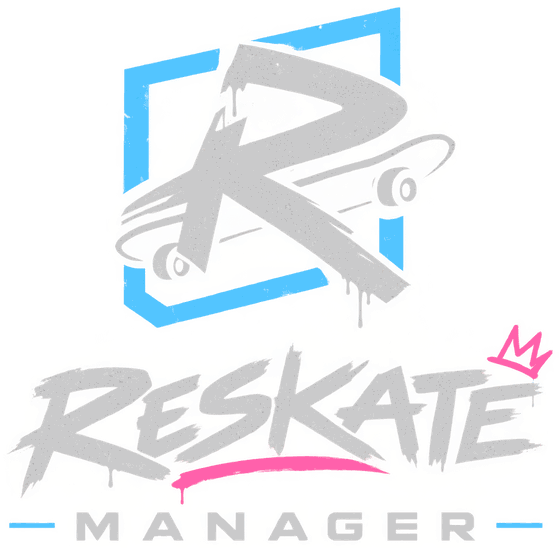
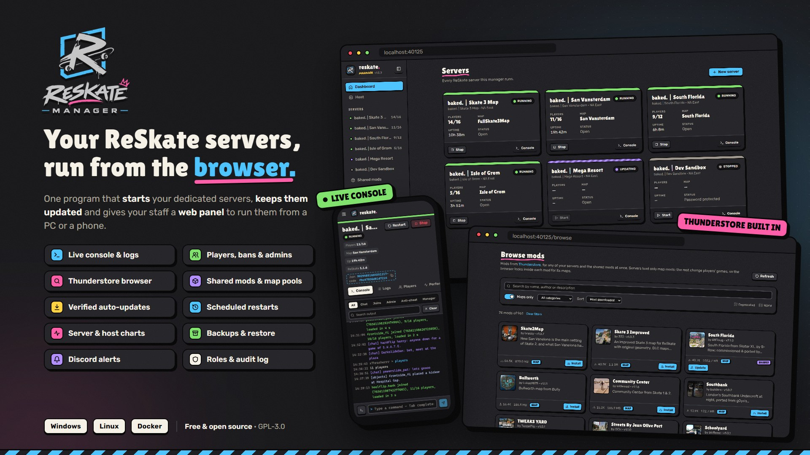

<div align="center">
  

  <p><strong>Run and manage <a href="https://github.com/Dingo-Shenanigans/ReSkate">ReSkate</a> dedicated servers from your browser.</strong></p>

  <p>
    <a href="https://github.com/xThrasherrr/ReSkateManager/actions/workflows/ci.yml"></a>
    <a href="https://github.com/xThrasherrr/ReSkateManager/releases/latest"></a>
    <a href="LICENSE"></a>
  </p>
</div>

---

ReSkateManager is a single program that starts your ReSkate servers, keeps them up to date, and gives your staff a web panel to run them. It runs on Windows, Linux and Docker, and manages several servers side by side, each in its own folder with its own ports.



## Table of contents

- [Features](#features)
  - [Console and logs](#console-and-logs)
  - [Players and server control](#players-and-server-control)
  - [Performance and monitoring](#performance-and-monitoring)
  - [Server settings and maps](#server-settings-and-maps)
  - [Mods](#mods)
  - [Updates and backups](#updates-and-backups)
  - [Users, roles and alerts](#users-roles-and-alerts)
- [Getting started](#getting-started)
  - [Windows](#windows)
  - [Linux](#linux)
  - [Docker](#docker)
- [Configuration](#configuration)
  - [Where everything is stored](#where-everything-is-stored)
  - [Exposing the panel](#exposing-the-panel)
  - [Settings, environment and flags](#settings-environment-and-flags)
- [Backups and restoring](#backups-and-restoring)
- [Troubleshooting](#troubleshooting)
- [How it works](#how-it-works)
- [Development](#development)
  - [Requirements](#requirements)
  - [Common tasks](#common-tasks)
  - [Project layout](#project-layout)
- [Contributing](#contributing)
- [License](#license)

## Features

### Console and logs

- **Live console:** server output streamed live and color-coded by type, with filters and search. Run commands with history and Tab completion, or switch to server chat. It opens on the newest lines, and **Clear** only hides output in your browser.
- **Logs:** read a server's own `ReSkateServer.log`, or everything the console showed while the manager ran it, Steam's lines included. Filter by time range and line type, search, then export what's shown or download a whole log file.

### Players and server control

- **Player management:** see who's online and who has played. Kick, ban, unban and manage in-game admins.
- **Crash recovery:** a crashed server restarts automatically, with backoff, up to five tries in a row.
- **Scheduled restarts:** restart a server at set times of day, or after so many hours up. Players get a warning in chat 10, 5 and 1 minute before; a server with nobody on restarts straight away.

### Performance and monitoring

- **Performance:** CPU, memory and player charts from the last hour up to 7 days, plus a summary of each run. Every server process is sampled every 30 s.
- **Network health:** bandwidth in and out, the worst player's ping, send-queue delay, lost sends and how busy the server's main loop is — charted on each server's Performance tab. Needs ReSkate 1.1.5+ with **Log player activity** on, so it shows what was happening before players noticed trouble.
- **Host performance:** one page for the machine the manager runs on — its CPU and memory over time with each server's share stacked underneath, the manager's own memory, servers running and players online. Memory the system only holds as cache counts as free. In Docker it shows the whole host plus the container's memory limit, if any. Below that, each drive the manager uses: free space, and what servers, shared mods, backups, releases and logs take up (refreshed at most every 10 minutes). Owners see this page by default; a role can grant it to others.

### Server settings and maps

- **Settings editor:** a form for every `ReSkateServer.json` setting. Most changes apply live through the server's own console commands. A few with no command (`max_players`, ports, `steam_token`, `global_bans`) go through a safe stop → write → start instead. Only owners can see or change a server's `steam_token`.
- **Map pool and rotation:** pick which maps players can vote for and how long the server stays on each. Edits apply live, admin changes included. The manager warns before you disable or delete a mod whose map is in a pool, since the server won't start without it.
- **World controls:** time of day and every world layer per map, applied live or saved for the next start (needs `world-layers.json` next to the server).

### Mods

- **Mod browser:** search Thunderstore's ReSkate mods, tick any of your servers and the shared mods, and install one on all of them at once. Shows the maps a mod adds before you download it, and can filter to mods that add maps.
- **Mods:** upload map mods as zips, sent in chunks so large maps clear proxy upload limits such as Cloudflare's. Enable, disable or delete mods, set a mod's map as the server's map, and update one mod or every outdated mod (**Update all**) in the background.
- **Shared mods:** keep one copy of a mod for several servers. Each server loads all, some, or none of them. Moving a server's mod into the shared pool (or turning shared mods on) swaps duplicate copies for links, reclaiming space.

### Updates and backups

- **Updates:** install new server releases on demand or automatically once a server is empty, each verified against the release's SHA-256 hashes. Owners can update the manager itself from the panel, which brings its servers back up afterward. The old binary stays as `.old` for ten minutes; a server update that fails partway restores the previous files.
- **Backups:** daily backups of the database, settings and each server's config, kept for the last seven — mods can be included too. Full details in [Backups and restoring](#backups-and-restoring).
- **Move a server:** export a server as a zip (settings, announcements and mods) and import it on another manager. Also covered in [Backups and restoring](#backups-and-restoring).
- **Housekeeping:** the audit log is kept 90 days and player history 180 days, both adjustable on the Manager page. Performance samples keep a week, and the release cache keeps the two newest downloads.

### Users, roles and alerts

- **Users and roles:**
  - Sign in with Steam or a password.
  - Roles grant access per server or on all servers, and decide which tabs of a server someone sees.
  - A role with "Be an in-game admin" syncs its users to in-game admin on those servers through their linked Steam account; admins added by hand are left alone.
  - Every action is recorded in an audit log.
  - Sign-ins are rate-limited (10 failures from one address in 5 minutes, or 20 against one account in 15). Sessions last 14 days; changing a password or linked Steam account signs out that user's other sessions.
  - **Run console commands** alone covers read-only and player-movement commands (`status`, `players`, `maps`, etc.). Kick, ban, admin and chat commands need their own permission, and everything else, settings included, needs **Change server settings**.
- **Announcements:** timed chat messages, such as a Discord invite, for one server or all of them, sent only while players are online.
- **Discord alerts:** a webhook notifies a channel on a crash, repeated crashes or a server stopping itself; on a server or manager update installing or failing; on a failed scheduled backup; and on low disk space (10 GB free by default) or sustained high memory (90% for 10 minutes by default, the container limit included in Docker) — each firing once when it starts and once when it clears. Any alert type can be turned off, and a test button checks the webhook.

## Getting started

Download the latest build from the [releases page](https://github.com/xThrasherrr/ReSkateManager/releases/latest). On first run the manager prints a one-time **setup PIN**. Open the panel and enter it to create the owner account.

Release candidates, such as `1.0.0-rc.1`, are published as pre-releases. A release never updates itself to one, and the image's `latest` tag stays on the last release. A candidate updates itself to the next candidate, then to the release. To try one in Docker, use its tag, such as `ghcr.io/xthrasherrr/reskate-manager:1.0.0-rc.1`.

### Windows

1. Unzip `ReSkateManager-<version>-windows-amd64.zip` anywhere and run `ReSkateManager.exe`.
2. Your browser opens to the panel with the setup PIN already filled in. The console window shows the panel address and the PIN too.
3. A tray icon reopens the panel. Its **Stop servers and quit** item shuts everything down cleanly.

### Linux

The release archive includes `reskate-manager.service`, a systemd unit with install steps at the top of the file.

```sh
sudo useradd --system --home /opt/reskate-manager reskate
sudo cp ReSkateManager /opt/reskate-manager/ && sudo chown -R reskate: /opt/reskate-manager
sudo cp reskate-manager.service /etc/systemd/system/
sudo systemctl enable --now reskate-manager
journalctl -u reskate-manager    # the setup PIN is printed here
```

- Servers install and update from the release's `ReSkateServer-Linux-<version>.tar.gz`, verified against the SHA-256 that GitHub records for it.
- Before a server starts, the manager links `~/.steam/sdk64/steamclient.so` to the server folder's copy, as `setup-linux-server-libs.sh` would. A working link that's already there is left alone.

### Docker

```sh
docker compose up -d             # uses compose.yaml from this repository
docker compose logs manager      # the setup PIN is printed here
```

- The image is `ghcr.io/xthrasherrr/reskate-manager`. Build it locally with `docker compose build`.
- All data lives in the `/data` volume. A bind mount must be writable by uid 1000.
- UDP `27015-27024` covers five servers. Host and container port numbers must match.
- The manager doesn't update itself in a container. To update, run `docker compose pull && docker compose up -d`.
- `docker stop` lets each server log off Steam. The compose file allows 45 s for that.
- Scheduled restart times follow the container's clock, which is UTC unless you set `TZ` in `compose.yaml`, such as `TZ: Europe/Berlin`.

## Configuration

Everything the manager keeps sits next to the executable, or under the directory given with `--root`.

### Where everything is stored

```
data/manager.toml   settings (listen address, public URL, TLS)
data/manager.db     servers, users, roles, sessions, announcements, performance and network samples, audit log, player history
data/manager.log
data/manager.lock   held while the manager runs, so a second one can't use the folder
servers/<id>/       one folder per server: ReSkateServer.exe, ReSkateServer.json, Mods/, ReSkateServer.log, console.log
shared/Mods/        shared mods, linked into the Mods/ of each server that uses them
backups/            backups, one zip each
cache/              downloaded server releases (the newest two are kept)
```

### Exposing the panel

The panel listens on `0.0.0.0:40125` by default. To expose it to the internet, serve it over HTTPS:

- **Behind a reverse proxy:** the last setup step asks how people open the panel; owners can change it later under **Manager**. It sets `proxy` (`"cloudflare"` behind Cloudflare, Cloudflare Tunnel included, or `"forwarded"` behind nginx, Caddy, Traefik and the like) and `public_url`, which Steam sign-in needs. With Docker you can set `RSM_PROXY` and `RSM_PUBLIC_URL` in `compose.yaml` instead. Make sure only the proxy can reach port 40125: with a tunnel on the same machine, `listen = "127.0.0.1:40125"` (or publish the port as `127.0.0.1:40125:40125`). The manager reads the visitor's address only from requests that come from this machine, a private network or, with `cloudflare`, Cloudflare's own servers, and logs a warning when one arrives from anywhere else.
- **Directly:** set `tls_cert` and `tls_key`.

Steam sign-in sends people back to `public_url`, so it needs the panel's address set, on any network: an owner sets it under **Manager**, such as `http://192.168.1.20:40125` at home. Only on the manager's own machine, through `localhost`, does it work without one.

### Settings, environment and flags

`data/manager.toml` is written on first start, with a note on each setting. Restart the manager after editing it.

| Setting | Default | What it does |
| --- | --- | --- |
| `listen` | `"0.0.0.0:40125"` | The panel's address and port |
| `public_url` | `""` | The address people open the panel at, such as `https://panel.example.com`. Steam sign-in needs it |
| `proxy` | `""` | The reverse proxy in front of the panel: `"cloudflare"`, `"forwarded"` or `""` for none |
| `tls_cert`, `tls_key` | `""` | PEM files to serve the panel over HTTPS directly; set both or neither |
| `open_browser` | `true` | Opens the panel when the manager starts on a desktop |
| `update_repo` | `"Dingo-Shenanigans/ReSkate"` | The GitHub repository whose releases carry the ReSkate server |
| `manager_repo` | `"xThrasherrr/ReSkateManager"` | The GitHub repository the manager updates itself from; `""` stops it looking |

| Environment | What it does |
| --- | --- |
| `RSM_PROXY`, `RSM_PUBLIC_URL` | Take the place of `proxy` and `public_url`, as in `compose.yaml` |
| `RSM_ROOT` | The folder to use when `--root` isn't given. The Docker image sets `/data` |
| `RSM_NO_SELF_UPDATE` | Any value stops the manager updating itself. The Docker image sets it: a new image is the update |

| Flag | What it does |
| --- | --- |
| `--root <folder>` | Where `data/`, `servers/` and the rest live; next to the executable by default |
| `--no-tray` | No tray icon (Windows) |
| `--no-browser` | Doesn't open the panel |
| `--restore <backup.zip>` | Restores a backup, then exits (see [Backups and restoring](#backups-and-restoring)) |
| `--launcher-json <file or URL>` | Takes server releases from this `launcher.json` instead of the latest release, to try one before it's published |
| `--version` | Prints the version and exits |

From 1.0 on, these names, the folder layout above, the backup format, the systemd unit's name and port 40125 stay as they are in every 1.x release, so an upgrade needs no changes on your side. The REST API behind the panel isn't one of them: it's internal to the panel and can change in any release.

## Backups and restoring

A backup is a zip in `backups/`, laid out like the manager's folder: `data/manager.db`, `data/manager.toml`, and `servers/<id>/` with each server's `ReSkateServer.json` and `world-layers.json`. Server programs are never in it, since they download again. Mods are in it only when you include them, as `servers/<id>/Mods/` and `shared/Mods/`. Owners set the schedule and how many to keep under **Manager**. The ones you make by hand stay until you delete them. A backup on the same disk won't survive that disk, so download one now and then, or mount another disk at `backups/`.

- **One server:** open its **Server** tab, stop it, and choose **Restore** on a backup. Its config and world layers go back as they were. With a backup that holds mods, its own mods are swapped for the backup's, and shared mods the manager no longer has come back. Servers without a program can install it again from the same dialog.
- **Everything:** stop the manager, then run it with `--restore` and the backup. It puts back the database and `manager.toml`, then each server's config and mods, and the shared mods that are missing. The database it replaces is backed up first. Everyone signs in again afterwards: the sessions in the backup are dropped, since some may have been ended since it was made. A backup from a newer manager, or a damaged database, is refused before anything is replaced, and so is a restore while a manager is running with the folder. A server whose folder was in the old `servers/` lands in this manager's, so a backup made on Windows restores into Docker too. Start the manager again afterwards.

  ```sh
  # Windows (in the manager's folder)
  ReSkateManager.exe --restore backups\backup-20261005-040000-scheduled.zip

  # Linux
  sudo systemctl stop reskate-manager
  sudo -u reskate /opt/reskate-manager/ReSkateManager --root /opt/reskate-manager --restore /opt/reskate-manager/backups/backup-20261005-040000-scheduled.zip
  sudo systemctl start reskate-manager

  # Docker; the cp is only needed for a backup that isn't in the volume
  docker compose stop manager
  docker compose cp backup-20261005-040000-scheduled.zip manager:/data/restore.zip
  docker compose run --rm manager --restore /data/restore.zip
  docker compose start manager
  ```

  To do it by hand instead, stop the manager, copy `data/manager.db` and `data/manager.toml` from the zip into `data/`, and delete `data/manager.db-wal` and `data/manager.db-shm` if they're there.
- **Moving a server to another manager:** on its **Server** tab choose **Export**, then on the other manager **New server**, **From an export**. It arrives in a new folder with its name, settings, announcements and mods, the shared ones it loaded included. Ports another server there already uses are changed.

## Troubleshooting

### Steam sign-in

- **"Steam sign-in needs the panel's address":** an owner sets it under **Manager** (or `public_url`, or `RSM_PUBLIC_URL` in Docker) to exactly what people type, such as `https://panel.example.com`. Steam sends people back to that address and nowhere else, so a panel opened under another name, an IP address or `www.` in front, can't finish signing in.
- **Behind a proxy:** set how people reach the panel under **Manager** as well (`proxy`: `cloudflare` or `forwarded`). Without it the manager takes every visitor for the proxy, and one person's failed sign-ins make everyone wait.
- **"Couldn't reach Steam to confirm the sign-in":** the manager checks each sign-in with `steamcommunity.com`, so the machine it runs on needs to reach it over HTTPS.
- **"That Steam account isn't linked to anyone on this panel":** sign in with a password and link the account on the **Account** page, or ask an owner to add the SteamID64 to the user.

### Ports and firewalls

- **The panel:** TCP 40125, or what `listen` says. Open it only to people who should reach the panel. Behind a proxy or tunnel on the same machine, listen on `127.0.0.1` so only the proxy can.
- **Each server:** a game port and a query port, both UDP, a pair from 27015 up: 27015 and 27016 for the first server, 27017 and 27018 for the next. A server's **Settings** tab shows its own. Players join over Steam's relay without them, but open them for the server browser's ping and faster joins. In Docker, host and container ports must match.
- **Windows:** the first start of a server may bring up a firewall prompt for `ReSkateServer.exe`. Allow it on the networks players come from.

### Linux and `steamclient.so`

- The server loads Steam from `~/.steam/sdk64/steamclient.so` of the user it runs as. Before each start the manager links that to the server folder's copy when nothing usable is there, so the service user needs a home folder it can write to, as the `useradd` line above gives it.
- If the console says **Could not link steamclient.so**, make the link yourself as that user, or run the release's `setup-linux-server-libs.sh`.
- A link that already works is left alone, even one to an older Steam client. If servers stop signing in to Steam after an update, delete `~/.steam/sdk64/steamclient.so` and the manager links the new one at the next start.

### The manager won't start

- **"another manager is already running with …":** one manager runs per folder. Stop the other, or give this one a folder of its own with `--root`.
- **"cannot listen on …":** another program holds the port. Change `listen` in `data/manager.toml`.

If the panel says it can't reach the manager, the manager stopped or is restarting, or a proxy in front of it is down. The panel keeps trying, and picks up again once the manager answers.

## How it works

ReSkateServer has no admin API, so the manager works entirely through each server's console.

- **Launch:** servers start with redirected stdin/stdout and `--no-update`. The manager installs updates itself, because the server's self-updater relaunches it under a process the manager can't track.
- **Output:** stdout lines (`[HH:MM:SS] text`) are parsed into typed events: joins, leaves, chat, admin commands, anti-cheat, votes and readiness. The formats come from `Server/server_host.cpp`. A line over 1 MiB is cut there, so it can't stall the reader or the server.
- **Commands:** commands go to the server one at a time, and each reply is matched to the command that produced it. Lines the server prints on its own are never taken as replies.
- **Config file:** the server rewrites `ReSkateServer.json` after every setting command, so the manager never writes that file while the server is running. Before a start, the manager fixes a server name the server would refuse (letters, numbers, spaces and `- _ / [ ] ( )` only) by dropping the other characters, and says so in the console.
- **Stop:** the manager sends `quit` so the server warns players and logs off Steam. If it hasn't exited after 15 s, it is killed.
- **Logs:** `ReSkateServer.log` rotates at 10 MB, keeping three old logs. After a manager restart, each console opens with the end of that log. The server writes only its own lines there, so while it runs the manager also writes everything the console shows to `console.log`: lines Steam prints too, the manager's notes and the commands sent, with who sent them. That one rotates at 10 MB as it goes, keeping three as well, and so does the manager's own `data/manager.log`.
- **Shared mods:** a server that uses them gets a link to each shared mod in its `Mods/`: a directory junction on Windows, which needs no admin rights, and a symlink elsewhere. The server reads a linked mod like any other. Links are checked when the manager starts and before each server starts, so a mod copied into `shared/Mods/` by hand reaches the servers at their next start. Deleting a link, or a whole server, never touches the shared copy.
- **Network health:** each server's `[network]` line is kept per run. The failed, skipped and dropped sends in it are totals since the server started, so the charts count each minute's from the line before.
- **Mods from Thunderstore:** the manager downloads a mod itself and installs it in the background while the panel follows its progress, so a big map isn't cut off by a proxy's time limit on one request (Cloudflare's is 100 s). To list a mod's maps, it reads only the zip's directory and its `reskate-levels.json` with HTTP range requests, usually a few hundred KB, from where Thunderstore stores the zip. That way looking doesn't count as a download. A few mods with long names are stored under names the manager can't work out; their maps show once installed.
- **Orphans:** on Windows every server runs in a job object, so none outlives the manager.

## Development

### Requirements

- Go 1.27+
- Node 22.17+ and pnpm 9
- [Task](https://taskfile.dev) (optional)

### Common tasks

```sh
task dev:api    # manager on :40125, data in ./dev
task dev:web    # panel with hot reload on :5173, proxied to the manager
task check      # go vet, go test, svelte-check
task build      # bin/ReSkateManager(.exe) with the panel embedded
```

Without Task: `cd web && pnpm install && pnpm build`, then `go build ./cmd/ReSkateManager`.

### Project layout

| Path | Purpose |
| --- | --- |
| `cmd/ReSkateManager` | Entry point and Windows tray |
| `cmd/reskate-watch` | What a new ReSkate release changes for the manager; filed hourly as an issue by the ReSkate watch workflow |
| `internal/supervisor` | Process, pipes, graceful stop, Windows job object |
| `internal/logparse` | stdout → typed entries; `players` and `maps` replies, `[network]` summaries |
| `internal/logfile` | Logs that rotate themselves: `console.log`, `data/manager.log` |
| `internal/instance` | Per-server state machine, console history, roster, command/reply matching |
| `internal/serverconfig` | `ReSkateServer.json` schema, validation, settings → console commands |
| `internal/updater` | Release lookup, verified download, staged install |
| `internal/perf` | CPU, memory and player samples for the performance charts, per server and for the machine |
| `internal/safezip` | Zip reading with caps on entry counts and sizes, for mods, backups and exports |
| `internal/lockfile` | `data/manager.lock`, which keeps a second manager off the folder |
| `internal/host` | The machine's CPU, memory and disk space, a container's memory limit, folder sizes |
| `internal/announce` | Timed chat announcements |
| `internal/restarts` | Scheduled restarts and their chat warnings |
| `internal/alerts` | Discord webhook alerts, and the watch on disk space and memory |
| `internal/housekeep` | Retention for the audit log and player history; old releases in `cache/` |
| `internal/backup` | Backups in `backups/`, restoring from them, server exports and imports |
| `internal/thunderstore` | Thunderstore package list, downloads, and reading a mod's zip by ranges |
| `internal/auth` | Users, roles and permissions, sessions, Steam OpenID |
| `internal/adminsync` | Keeps in-game admins in step with panel roles |
| `internal/config` | `data/manager.toml` and its environment overrides |
| `internal/store` | SQLite database and migrations |
| `internal/api` | REST and WebSocket API |
| `web/` | SvelteKit (Svelte 5) + Tailwind panel |

## Contributing

Contributions are welcome, whether a bug report, an idea or a pull request.

- **Bugs and feature requests:** open an [issue](https://github.com/xThrasherrr/ReSkateManager/issues). For bugs, include your OS, the manager and server versions, and the relevant lines from `data/manager.log`.
- **Security problems:** report them privately, as [SECURITY.md](SECURITY.md) describes, not in an issue.
- **Pull requests:**
  1. Fork the repository and create a branch from `main`.
  2. Keep each pull request focused on one change.
  3. Run `task check` and make sure it passes. CI runs the same checks.
  4. Write commit subjects as `type(scope): description` in the imperative mood, for example `fix(updater): retry interrupted downloads`. Types: `feat`, `fix`, `tweak`, `refactor`, `perf`, `style`, `docs`, `test`, `chore`, `build`, `revert`.
  5. Open the pull request against `main` with a short description of what changed and why.

By contributing, you agree that your contributions are licensed under the project's GPL-3.0 license.

## License

ReSkateManager is licensed under the [GNU General Public License v3.0](LICENSE), the same license as ReSkate.
